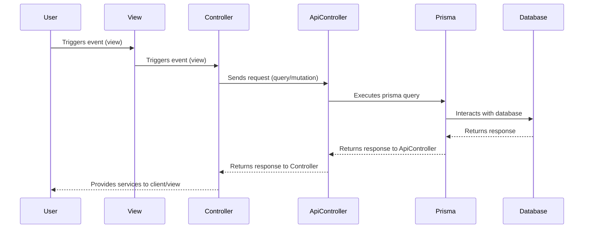

* Client side controller for sending query/mutation requests to ApiController.
* 1. Client side event (view) triggers useQuery or useMutation function call
* 2. Controller sends requests to ApiController
* 3. Controller receives response from ApiController
* 4. Controller provides services to client/view
* Server side controller for interacting with database.
* 1. Controller sends requests to ApiController
* 2. ApiController executes prisma query
* 3. Prisma interacts with database and returns response
* 4. ApiController returns Prisma response to Controller

## ============= commit messages ==========

feat: add hat wobble
^--^ ^------------^
| |
| +-> Summary in present tense.
|
+-------> Type: chore, docs, feat, fix, refactor, style, or test.
More Examples:

feat: (new feature for the user, not a new feature for build script)
fix: (bug fix for the user, not a fix to a build script)
docs: (changes to the documentation)
style: (formatting, missing semi colons, etc; no production code change)
refactor: (refactoring production code, eg. renaming a variable)
test: (adding missing tests, refactoring tests; no production code change)
chore: (updating grunt tasks etc; no production code change)

============= File structue ============
- assets
  - styles (theme & styles)
  - compontents (UI components - not layout or page specific)
  - (optional) vanilla TS code (non framework)
- views (page specific components & hooks)
  - layouts (layout components)
- pages
  - api (node.js service handlers backend)
- lib-client (decoupled front-end logic)
  - controllers (query & mutations)
  - stores (front-end state management)
  - hooks (custom hooks)
  - constants
- lib-server (decoupled back-end logic)
  - api-controllers
  - constants
- prisma (rename to model?)
  - schema.prisma = model definitions
  - zod = zod schemas generated from prisma models
  - migrations = SQL syntax
- utils (small helper functions)
- config
- pages.ts = page layout data
