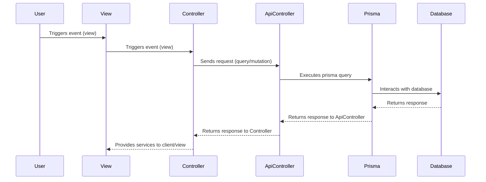
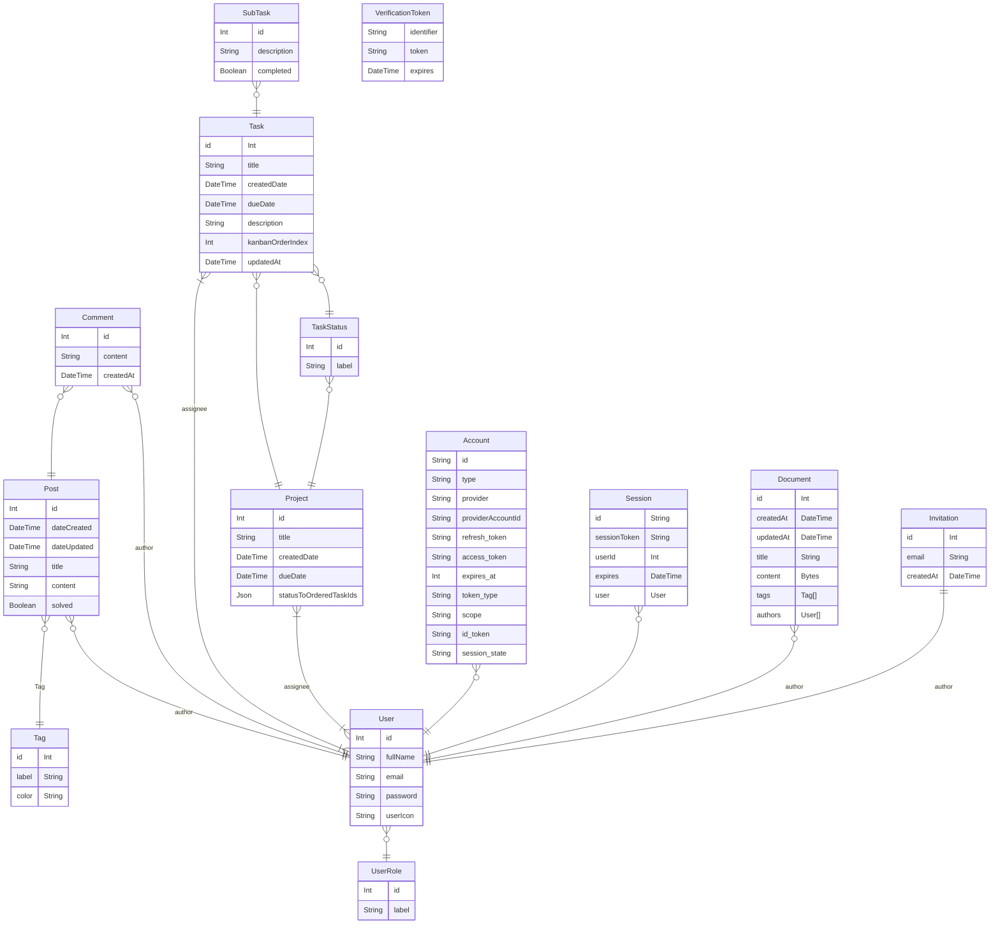

<!-- Do a search and replace with your text editor for the following:
`DawidWraga`,
`team-project`,
`Make-it-all portal`,
`Task management and knowledge base employee portal` -->

<!-- README TOP-->

<a name="readme-top"></a>

<!-- PROJECT SHIELDS -->
<!--
*** I'm using markdown "reference style" links for readability.
*** Reference links are enclosed in brackets [ ] instead of parentheses ( ).
*** See the bottom of this document for the declaration of the reference variables
*** for contributors-url, forks-url, etc. This is an optional, concise syntax you may use.
*** https://www.markdownguide.org/basic-syntax/#reference-style-links
-->

[![Contributors][contributors-shield]][contributors-url]
[![Forks][forks-shield]][forks-url]
[![Stargazers][stars-shield]][stars-url]
[![Issues][issues-shield]][issues-url]
[![LinkedIn][linkedin-shield]][linkedin-url]

<!-- PROJECT LOGO -->
<br />
<div align="center">
  <a href="https://github.com/DawidWraga/team-project">
    
  </a>

<h3 align="center">Make-it-all portal</h3>

  <p align="center">
    Task management and knowledge base employee portal
    <!-- <br />
    <a href="https://github.com/DawidWraga/team-project"><strong>Explore the docs »</strong></a> -->
    <br />
    <br />
    <a href="https://github.com/DawidWraga/team-project">View Demo</a>
    ·
    <a href="https://github.com/DawidWraga/team-project/issues">Report Bug</a>
    ·
    <a href="https://github.com/DawidWraga/team-project/issues">Request Feature</a>
  </p>
</div>

<!-- TABLE OF CONTENTS -->
<details>
  <summary>Table of Contents</summary>
  <ol>
    <li>
      <a href="#about-the-project">About The Project</a>
      <ul>
         <li><a href="#overview">Overview</a></li>
        <li><a href="#tech-stack">Tech Stack</a></li>
        <li><a href="#folder-structure">Folder Structure</a></li>
        <li><a href="#dataflow">Dataflow sequence diagram</a></li>
      </ul>
    </li>
    <li>
      <a href="#getting-started">Getting Started</a>
      <ul>
        <li><a href="#prerequisites">Prerequisites</a></li>
        <li><a href="#installation">Installation</a></li>
      </ul>
    </li>
    <li><a href="#usage">Usage</a></li>
    <li><a href="#roadmap">Roadmap</a></li>
    <li><a href="#contributing">Contributing</a></li>
    <li><a href="#contact">Contact</a></li>
    <li><a href="#acknowledgments">Acknowledgments</a></li>
  </ol>
</details>

<!-- ABOUT THE PROJECT -->

## About The Project

<!-- OVERVIEW -->

### Overview

[![Product Name Screen Shot][product-screenshot]](https://example.com)

Overview of the project

<p align="right">(<a href="#readme-top">back to top</a>)</p>

<!-- Tech Stack -->

### Tech Stack

| Dependency                                                      | Function                                                |
| --------------------------------------------------------------- | ------------------------------------------------------- |
| [![Typescript][typescript-icon]][typescript-url]                | Base Programming language                               |
| [![React][react-icon]][react-url]                               | UI library                                              |
| [![Chakra][chakra-icon]][chakra-url]                            | UI Component library                                    |
| [![Framer-motion][framer-motion-icon]][framer-motion-url]       | Animation library                                       |
| [![Zustand][zustand-icon]][zustand-url]                         | State management (synchronous state only)               |
| [![React Query][react-query-icon]][react-query-url]             | State management (async state only)                     |
| [![React hook form][react-hook-form-icon]][react-hook-form-url] | Form validation & state management                      |
| [![Next][next-icon]][next-url]                                  | Client & server routing, performance & SEO optimization |
| [![MySql][mysql-icon]][mysql-url]                               | Database                                                |
| [![Prisma][prisma-icon]][prisma-url]                            | ORM - improved database interface                       |

<!-- FOLDER STRUCTURE -->

### Folder Structure

```
src
 ┃
 ┃	// ───────── Routing ─────────
 ┃
 ┣ 📂pages  						// Page routes
 ┃ ┣ 📜_app.tsx  					// Global context providers
 ┃ ┗  ...
 ┃ ┣ 📂api  						// API routes
 ┃ ┃ ┣ 📂auth
 ┃ ┃ ┣ ┗ 📜[...nextauth].ts  				// Authentication handlers
 ┃ ┃ ┗ ...
 ┃
 ┃	// ───────── Client ─────────
 ┃
 ┣ 📂views  						// Page specific components
 ┣ 📂components  					// Shared components
 ┣ 📂layouts  						// Layout wrappers
 ┣ 📂lib-client  					// Client-side business logic
 ┃ ┣ 📂hooks  						// Custom react hooks
 ┃ ┣ 📂stores  						// State management stores
 ┃ ┣ 📜useQuery.ts  					// Hook for handling read fetches
 ┃ ┗ 📜useMutation.ts  					// Hook for handling write fetches
 ┣ 📂styles
 ┃
 ┃	// ───────── Server ─────────
 ┃
 ┣ 📂lib-server  					// Server-side business logic
 ┣ 📂prisma
 ┃ ┣ 📂migrations 	 				// Prisma to MySQL migrations
 ┃ ┣ 📂zod  						// Database zod schemas
 ┃ ┗ 📜schema.prisma  					// Database schema
 ┃
 ┃	// ───────── Other ─────────
 ┃
 ┣ 📂config
 ┃ ┣ 📜constants.ts  					// Shared constants
 ┃ ┗ 📜pages.ts  					// Page constants (routes, icons, labels)
 ┣ 📂types
 ┣ 📂utils


```

<!-- DATAFLOW -->

### Dataflow Sequence Diagram



<!-- ER Diagram -->

### ER Diagram



<p align="right">(<a href="#readme-top">back to top</a>)</p>

<!-- GETTING STARTED -->

## Getting Started

To get a local copy up and running, follow these simple steps.

### Prerequisites

- [Node.js](https://nodejs.org/en/download/)
- [npm](https://docs.npmjs.com/downloading-and-installing-node-js-and-npm)

### Installation

1. Clone the repo

   ```sh
   git clone https://github.com/DawidWraga/team-project.git
   ```

2. Install NPM packages

   ```sh
   npm install

   ```

3. Run in development mode
   ```sh
   npm run dev
   ```
4. Open in browser ( http://localhost:3000 )

<p align="right">(<a href="#readme-top">back to top</a>)</p>

<!-- USAGE EXAMPLES -->

## Usage

Use this space to show useful examples of how a project can be used. Additional screenshots, code examples and demos work well in this space. You may also link to more resources.

_For more examples, please refer to the [Documentation](https://example.com)_

<p align="right">(<a href="#readme-top">back to top</a>)</p>

<!-- ROADMAP -->

## Roadmap

- [ ] Feature 1
- [ ] Feature 2
- [ ] Feature 3
  - [ ] Nested Feature

See the [open issues](https://github.com/DawidWraga/team-project/issues) for a full list of proposed features (and known issues).

<p align="right">(<a href="#readme-top">back to top</a>)</p>

<!-- CONTRIBUTING -->

## Contributing

Contributions are what make the open source community such an amazing place to learn, inspire, and create. Any contributions you make are **greatly appreciated**.

If you have a suggestion that would make this better, please fork the repo and create a pull request. You can also simply open an issue with the tag "enhancement".
Don't forget to give the project a star! Thanks again!

1. Fork the Project
2. Create your Feature Branch (`git checkout -b feature/AmazingFeature`)
3. Commit your Changes (`git commit -m 'feat: added some feature'`)
4. Push to the Branch (`git push origin feature/AmazingFeature`)
5. Open a Pull Request

**Please ensure to use conventional commit messages** ([Conventional Commit Messages](https://gist.github.com/qoomon/5dfcdf8eec66a051ecd85625518cfd13))

<p align="right">(<a href="#readme-top">back to top</a>)</p>

<!-- CONTACT -->

## Contact

If you have any questions, suggestions or feedback related to this project, I would love to hear from you. Please feel free to reach out to me through any of the channels listed below.

Dawid Wraga - dpwraga@gmail.com - [LinkedIn](https://www.linkedin.com/in/dawid-wraga/)

<p align="right">(<a href="#readme-top">back to top</a>)</p>

<!-- ACKNOWLEDGMENTS -->

## Acknowledgments

- []()
- []()
- []()

<p align="right">(<a href="#readme-top">back to top</a>)</p>

<!-- MARKDOWN LINKS & IMAGES -->

<!-- https://www.markdownguide.org/basic-syntax/#reference-style-links -->
<!-- icon source: https://simpleicons.org/?q=mysql -->

[contributors-shield]: https://img.shields.io/github/contributors/DawidWraga/team-project.svg?style=for-the-badge
[contributors-url]: https://github.com/DawidWraga/team-project/graphs/contributors
[forks-shield]: https://img.shields.io/github/forks/DawidWraga/team-project.svg?style=for-the-badge
[forks-url]: https://github.com/DawidWraga/team-project/network/members
[stars-shield]: https://img.shields.io/github/stars/DawidWraga/team-project.svg?style=for-the-badge
[stars-url]: https://github.com/DawidWraga/team-project/stargazers
[issues-shield]: https://img.shields.io/github/issues/DawidWraga/team-project.svg?style=for-the-badge
[issues-url]: https://github.com/DawidWraga/team-project/issues
[linkedin-shield]: https://img.shields.io/badge/-LinkedIn-black.svg?style=for-the-badge&logo=linkedin&colorB=555
[linkedin-url]: https://linkedin.com/in/dawid-wraga
[product-screenshot]: images/screenshot.png
[next-icon]: https://img.shields.io/badge/next.js-20232A?style=for-the-badge&logo=nextdotjs&logoColor=white
[next-url]: https://nextjs.org/
[react-icon]: https://img.shields.io/badge/React-white?style=for-the-badge&logo=react&logoColor=61DAFB
[react-url]: https://reactjs.org/
[typescript-icon]: https://img.shields.io/badge/-typescript-3178C6?style=for-the-badge&logo=typescript&logoColor=white
[typescript-url]: https://www.typescriptlang.org/
[react-query-icon]: https://img.shields.io/badge/-react%20query-FF4154?style=for-the-badge&logo=react%20query&logoColor=white
[react-query-url]: https://react-query-v3.tanstack.com/
[react-hook-form-icon]: https://img.shields.io/badge/-react%20hook%20form-EC5990?style=for-the-badge&logo=react%20hook%20form&logoColor=white
[react-hook-form-url]: https://react-hook-form.com/
[mysql-icon]: https://img.shields.io/badge/-mysql-4479A1?style=for-the-badge&logo=mysql&logoColor=white
[mysql-url]: https://www.mysql.com/
[prisma-icon]: https://img.shields.io/badge/-prisma-2D3748?style=for-the-badge&logo=prisma&logoColor=white
[prisma-url]: https://www.prisma.io/
[zustand-icon]: https://img.shields.io/badge/-Zustand-2D3748?style=for-the-badge&logo=OpenZeppelin&logoColor=white
[zustand-url]: https://github.com/pmndrs/zustand
[chakra-icon]: https://img.shields.io/badge/-Chakra%20ui-319795?style=for-the-badge&logo=Chakra%20Ui&logoColor=white
[chakra-url]: https://chakra-ui.com/
[framer-motion-icon]: https://img.shields.io/badge/-Framer%20motion-0055FF?style=for-the-badge&logo=Framer&logoColor=white
[framer-motion-url]: https://www.framer.com/motion/
